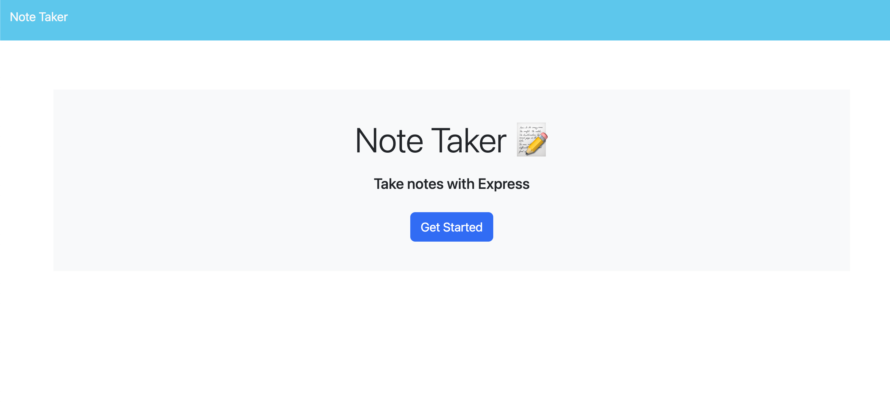

# NotePLUS
  ## Table of Contents
    
  - [Description](#description)
  - [Installation](#installation)
  - [Usage](#usage)
  - [License](#license)
  - [Contribution Guidelines](#contribution)
  - [Credits](#credits)
  
  
  ## Description

  NotePLUS is an application designed for business owners needing to stay organized. It allows the user to input and save notes in order to keep track of any tasks that need completing.
  
  ## Installation
  
  If you're looking to see how the application works on the backend, clone the repository to your local machine and install the necessary npm packages via the terminal using "npm install". To start the server, use "npx nodemon server.js" and test out the paths and requests using Insomnia or Postman.

  ## Usage
  
  To use the deployed application, [click here](https://note-plus.herokuapp.com/). Once on the page, click "Get started" on the main page. There you will see the notes already in the system, and a plus icon to enter a new one. When you click the icon, you can enter a title for your new note and some text for more details. A save icon will appear, which you can click in order to save your new note.

  

  ## License
    This project is licensed under the MIT License.
  
  [Click here to view the MIT license](https://opensource.org/license/mit/)
  
  ## Contribution Guidelines
  Starter code was provided by [Xandromus](https://github.com/Xandromus), [nol166](https://github.com/nol166), and [GeorgeYoo](https://github.com/Georgeyoo) on Github. The starter repository can be found [here](https://github.com/coding-boot-camp/miniature-eureka).
  Anyone may clone the repository and contribute to the project to fix bugs or add features.

  ## Credits

  [julie-mac](https://github.com/julie-mac)
  [Xandromus](https://github.com/Xandromus)
  [nol166](https://github.com/nol166)
  [GeorgeYoo](https://github.com/Georgeyoo)
